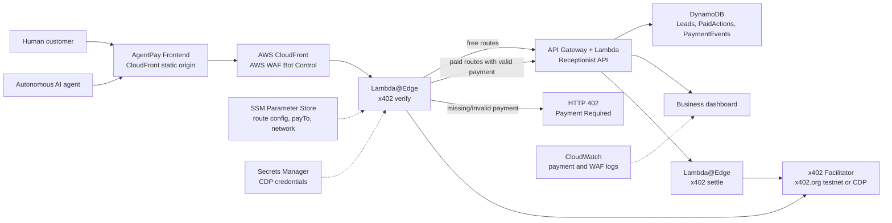

# AgentPay Receptionist

**The AI receptionist that agents can pay.**

AgentPay Receptionist turns a local service business into an AI-powered, machine-readable, payment-enabled service endpoint. Humans and autonomous AI agents can ask free questions, discover services, request quotes, and pay USDC over HTTP for premium actions such as holding an appointment slot.

This hackathon MVP uses the AWS x402 CloudFront/WAF sample as the infrastructure blueprint, adapted from content monetization to paid business-action monetization. Instead of protecting `/articles/**`, the judged flow protects `POST /api/paid/hold-slot`.

## Codebase Layout

This folder is the cleaned AgentPay project. The original imported AWS sample can stay nearby as reference, but it is not needed to run this app.

```text
frontend/                  Four-page browser demo
demo/local-server.mjs       Local development server and mock API
src/api/handler.ts          AWS Lambda origin API router
src/api/businessProfile.ts  Free machine-readable capability catalog
src/api/chat.ts             Deterministic receptionist flow
src/api/paidActions.ts      x402-gated hold-slot and paid-action handlers
src/api/storage.ts          Memory/DynamoDB lead and payment-event storage
src/edge/                   Lambda@Edge x402 verification and settlement
src/waf-sync/               SSM route config to AWS WAF rule sync
scripts/agent-pay-hold-slot.mjs
                            Real @x402/fetch autonomous buyer flow
tests/api.test.mjs          Tiny API route test suite
src/deploy/static-content/  CloudFormation custom resource for frontend upload
config/default-routes.json  Free and paid route pricing
template.yaml               Clean SAM deployment template
```

## Why It Matters

AI agents can search and reason, but they still struggle to transact with real-world local businesses. Local businesses have websites, forms, and phone numbers, but not payable APIs that agents can discover, understand, and use.

AgentPay Receptionist gives the business:

- A free AI front desk for informational questions.
- A free machine-readable business profile for autonomous agents.
- x402-paid action endpoints for scarce or valuable business actions.
- A dashboard that shows paid leads, payment status, transcript snippets, and x402 event logs.

## Demo Business

The MVP business is **Miami Elite Auto Detail**.

Demo story:

1. A customer or autonomous agent asks for a same-day ceramic detail appointment.
2. The AI receptionist asks a qualifying question and offers a **4:30 PM priority appointment hold**.
3. Holding the slot requires a **$5 USDC deposit**.
4. The app attempts `POST /api/paid/hold-slot` without payment.
5. AWS CloudFront/WAF/Lambda@Edge returns **HTTP 402 Payment Required**.
6. The client retries with x402 payment information.
7. The backend creates a booking/lead record.
8. The dashboard updates with the paid lead and x402 event timeline.

The UI shows the required timeline statuses:

- `REQUEST_RECEIVED`
- `PAYMENT_REQUIRED_402`
- `PAYMENT_SIGNATURE_RECEIVED`
- `PAYMENT_VERIFIED`
- `ACTION_COMPLETED`
- `LEAD_CREATED`

## Architecture



Production-style request path:

```text
Frontend
  -> AWS CloudFront / WAF
  -> x402 payment gate for /api/paid/**
  -> API Gateway / Lambda origin API
  -> AI receptionist logic + DynamoDB storage
```

## AWS Usage

This project keeps AWS as the visible hackathon infrastructure layer:

- **CloudFront** serves the frontend and routes `/api/*` to the origin API.
- **AWS WAF Bot Control** labels traffic and injects route pricing headers from SSM route config.
- **Lambda@Edge origin-request** verifies x402 payments before paid requests reach the API.
- **Lambda@Edge origin-response** settles verified payments after successful origin responses.
- **API Gateway + Lambda** host the receptionist API routes.
- **DynamoDB** stores leads, paid actions, and payment events.
- **SSM Parameter Store** stores route config, network, pay-to address, and facilitator URL.
- **Secrets Manager** stores CDP facilitator credentials when using Coinbase CDP.
- **CloudWatch** provides logs and dashboard widgets for payment and WAF activity.

## x402 Usage

Paid routes are fixed-price x402 actions using:

- Scheme: `exact`
- Currency: `USDC`
- Demo network: `eip155:84532` Base Sepolia
- Production-ready network: `eip155:8453` Base mainnet
- Pay-to address: `PAY_TO_ADDRESS` / `PayToAddress`
- Protected resource description: `Hold a priority appointment slot with a local business receptionist.`

Facilitator options:

- `x402.org` facilitator: fastest for testnet demos on Base Sepolia.
- `cdp` facilitator: Coinbase Developer Platform production path for testnet and mainnet, with credentials stored in Secrets Manager.

## Pages

1. **Landing**: polished product explanation and architecture summary.
2. **Customer Chat Demo**: human talks to the AI receptionist and triggers the paid hold-slot action.
3. **Agent API Simulator**: autonomous agent discovers the business profile, sees paid capabilities, attempts a paid action, receives 402, pays, and receives structured booking JSON.
4. **Business Dashboard**: paid leads, payment status, transcript snippets, booking details, and x402 event logs.

The Agent API Simulator is the key agentic demo surface.

## API Routes

Free routes:

| Method | Route | Purpose |
|---|---|---|
| `GET` | `/api/health` | Health check |
| `GET` | `/api/agent/business-profile` | Machine-readable business profile and capability catalog |
| `POST` | `/api/chat` | Free receptionist chat and lead qualification |
| `GET` | `/api/dashboard/leads` | Business dashboard leads |
| `GET` | `/api/dashboard/payments` | Business dashboard payment actions and event logs |
| `POST` | `/api/dashboard/reset` | Clear demo leads, payments, and event logs for clean judging runs |

Paid routes:

| Method | Route | Price | Status |
|---|---|---:|---|
| `POST` | `/api/paid/hold-slot` | `$5.00` USDC | Fully implemented |
| `POST` | `/api/paid/quote-request` | `$1.00` USDC | Configured roadmap stub |
| `POST` | `/api/paid/priority-callback` | `$2.00` USDC | Configured roadmap stub |

Successful hold-slot response:

```json
{
  "success": true,
  "action": "hold_slot",
  "bookingId": "lead_...",
  "businessName": "Miami Elite Auto Detail",
  "service": "Same-day ceramic detail",
  "appointmentTime": "2026-05-05T16:30:00-04:00",
  "amountPaid": "5.00",
  "currency": "USDC",
  "network": "eip155:84532",
  "paymentStatus": "settled"
}
```

## Local Demo

The local demo uses a small Node server with the same frontend and mock API behavior. The main browser payment path creates a real x402 payment payload with an injected wallet. For autonomous-agent testing, the CLI buyer uses `@x402/fetch` to receive HTTP 402 and retry with an x402 payment header.

Local mode accepts a signed x402 header so you can exercise the UI without live settlement. Live verification and settlement happen in the AWS CloudFront/Lambda@Edge deployment.

```bash
npm run dev:demo
```

Open:

```text
http://127.0.0.1:8787
```

Useful local checks:

```bash
curl -s http://127.0.0.1:8787/api/agent/business-profile | jq

curl -i -X POST http://127.0.0.1:8787/api/paid/hold-slot \
  -H 'content-type: application/json' \
  -d '{"service":"Same-day ceramic detail"}'

curl -s -X POST http://127.0.0.1:8787/api/dashboard/reset | jq
```

Real agent buyer flow:

```bash
X402_BUYER_PRIVATE_KEY=0x... \
AGENTPAY_BASE_URL=http://127.0.0.1:8787 \
npm run agent:pay
```

## AWS Deploy

Prerequisites:

- AWS account with permissions for CloudFront, WAF, Lambda@Edge, API Gateway, DynamoDB, S3, SSM, Secrets Manager, CloudWatch, and IAM.
- AWS SAM CLI.
- Node.js 24+.
- Ethereum address to receive USDC payments.

Deploy:

```bash
npm install
npm run build
sam build
sam deploy --guided --region us-east-1 --capabilities CAPABILITY_NAMED_IAM
```

Key SAM parameters:

| Parameter | Description | Default |
|---|---|---|
| `PayToAddress` | Wallet address receiving USDC | Required |
| `Network` | `eip155:84532` Base Sepolia or `eip155:8453` Base mainnet | `eip155:84532` |
| `FacilitatorType` | `x402.org` or `cdp` | `x402.org` |
| `CdpApiKeyName` | CDP key name for Coinbase facilitator | Empty |
| `CdpApiKeyPrivateKey` | CDP private key for Coinbase facilitator | Empty |
| `RouteConfigJson` | Free and paid route pricing config | AgentPay defaults |

Stack outputs include:

- `FrontendUrl`
- `BusinessApiOriginUrl`
- `AgentPayTableName`
- `CloudWatchDashboardUrl`
- SSM config parameter paths

## Route Configuration

The default config makes discovery/chat/dashboard routes free and paid actions chargeable:

```json
{
  "pattern": "/api/paid/hold-slot",
  "policies": [{ "condition": "default", "action": "5.00" }]
}
```

Update pricing without redeploying:

```bash
aws ssm put-parameter \
  --name "/x402-edge/<stack-name>/config/routes" \
  --value '<paste JSON here>' \
  --type String \
  --overwrite
```

## AI Receptionist Behavior11

The MVP uses a deterministic flow for demo reliability:

- Greets as the AI front desk, not a human.
- Answers normal informational questions for free.
- Asks one qualifying question at a time.
- Offers a 4:30 PM priority hold for same-day ceramic detail requests.
- Requires payment only for appointment holds, verified quote requests, and priority callbacks.
- Returns structured chat fields: `reply`, `intent`, `requiresPayment`, `paidAction`, and `leadFields`.

The code is ready for optional LLM polish, but the judged payment flow does not depend on a live model call.

## Data Model

DynamoDB stores a single-table model:

- `Business`
- `PaidAction`
- `Lead`
- `PaymentEvent`

The local demo uses an in-memory mock store. The AWS deployment writes leads, paid actions, and payment events to DynamoDB.

## Tests

```bash
npm test
```

The test suite covers `/api/chat`, `/api/agent/business-profile`, unpaid and paid `/api/paid/hold-slot`, dashboard reads, and demo reset.

## Roadmap

- Multi-tenant onboarding for any local service business.
- Wallet funding/status UX and richer agent SDK examples.
- Rich quote-request and priority-callback paid actions.
- Business owner authentication and CRM export.
- OpenAPI/AI plugin manifest generation for agent discovery.
- Mainnet Base deployment using Coinbase CDP Facilitator.

## Final Pitch

In the old internet, businesses needed websites. In the agentic internet, businesses need payable endpoints. AgentPay Receptionist gives every local business an AI front desk that humans and autonomous agents can pay over HTTP using x402.
