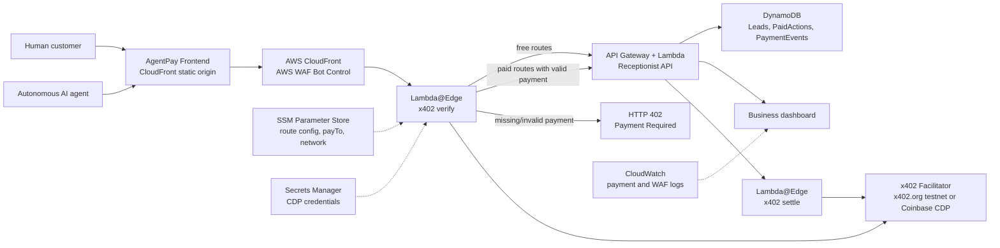

# AgentPay Receptionist

## Link to deployed demo 

https://d2pc20oig2383p.cloudfront.net/#/

> AgentPay gives local businesses a payment-gated AI receptionist to help autonomous AI agents discover and book services with x402 HTTP payments.

AgentPay Receptionist turns any local service business into a payable HTTP endpoint — discoverable by humans and callable by autonomous AI agents, settled in USDC via the x402 protocol.

---

## The Problem

AI agents are getting better at searching, reasoning, and planning — but they still cannot transact with real-world local businesses. Local businesses have websites and phone numbers, but not a machine-readable capability catalog that agents can parse, a standard protocol for paying for scarce actions like appointment holds or priority quotes, or any way to see which leads came from autonomous agents and were pre-paid.

---

## What We Built

AgentPay Receptionist turns a local business into a payable API endpoint that humans and AI agents can both use. The demo is **Miami Elite Auto Detail**. Humans chat with the AI receptionist for free. When they want to actually hold an appointment slot, they pay a small USDC fee. An autonomous AI agent can do the exact same thing in code: discover what the business offers, hit the paid endpoint, get an HTTP 402 back, pay automatically using x402, and receive a booking confirmation as JSON. No human needed on either end.

AgentPay Receptionist gives every local business three things:

1. **An AI front desk for humans** — a chat interface that greets customers, answers questions for free, qualifies their service needs, and offers to hold a priority appointment slot once the request is real.
2. **A machine-readable API for autonomous agents** — `GET /api/agent/business-profile` returns a structured capability catalog with free capabilities, paid capabilities, input schemas, prices, and x402 payment parameters. An agent knows exactly what to call next with zero human integration work.
3. **A business owner dashboard** — live paid leads, payment status per action, and a full x402 event timeline from `REQUEST_RECEIVED → PAYMENT_REQUIRED_402 → PAYMENT_VERIFIED → LEAD_CREATED`.

The MVP demo is **Miami Elite Auto Detail**. A human or AI agent asks for a same-day ceramic coating appointment, the AI receptionist qualifies the request, the agent hits `POST /api/paid/hold-slot`, receives `HTTP 402 Payment Required`, pays `$0.50 USDC` on Base Sepolia using `@x402/fetch`, and receives a structured booking confirmation. The paid lead appears on the dashboard instantly.

---

## How We Used Coinbase x402

x402 is Coinbase's open protocol that puts payments directly into HTTP using the long-dormant 402 status code. Any server can declare a price, any client that speaks x402 pays automatically. That's what makes it perfect for agents — there's no wallet UI, no OAuth, no custom integration required.

We used three packages from the x402 SDK. `@x402/core` handles payment verification and settlement on the server side. `@x402/evm` provides the EVM payment scheme for USDC on Base. And `@x402/fetch` wraps the standard fetch API so when our agent script hits a 402 response, it automatically signs the payment and retries. The entire agent buyer CLI is about 75 lines of code because the protocol handles everything.

Payments use the exact scheme with USDC on Base Sepolia at $0.50 per slot hold. Exact scheme means a fixed price, no slippage, straight USDC transfer. Switching to Base mainnet is one config change, no code touched. We support both the x402.org testnet facilitator for the demo and the Coinbase CDP facilitator for production.

The key architectural choice was putting `x402HTTPResourceServer` inside AWS Lambda@Edge rather than the application API. Unpaid requests get rejected at CloudFront before they ever reach our origin. The business API never sees an unauthorized call on a paid route.

---

## How We Used AWS

The whole stack is one AWS SAM deployment. CloudFront serves the frontend from a private S3 bucket and routes all API traffic through Lambda@Edge before hitting API Gateway. AWS WAF Bot Control labels agent vs. human traffic and injects per-route pricing headers that Lambda@Edge reads to decide what's free and what's paid.

Route pricing lives in SSM Parameter Store and syncs into a WAF custom rule group every five minutes via a scheduled Lambda. Changing a price or adding a new paid route is two AWS CLI calls with no redeployment needed.

The origin API runs on API Gateway and Lambda, handles all the business logic, and writes leads and payment records to DynamoDB. The verify-then-settle flow is split across two Lambda@Edge functions: origin-request verifies the payment signature before the request reaches the API, origin-response settles the payment only after the API returns a successful 200. Payment without delivery and delivery without payment are both impossible by design.

The whole infrastructure pattern is adapted directly from the [AWS sample-x402-content-monetization-with-cloudfront-and-waf](https://github.com/coinbase/x402/tree/main/examples/typescript/servers/cloudfront-lambda-edge) reference, but repurposed from protecting static content to protecting live API actions.

---

## Why This Combination Worked

Lambda@Edge and x402 are a natural fit because x402's server abstraction is stateless enough to run inside a CDN function. That's what makes the zero-trust payment gate possible at the infrastructure layer without touching application code. `@x402/fetch` is what makes the agent demo tangible: you can run a single script, watch a real USDC transfer happen on Base Sepolia, and see the paid lead appear in the dashboard immediately. And `GET /api/agent/business-profile` is the discovery primitive that makes the whole thing work: one GET request returns everything an agent needs to transact with the business, including endpoint paths, input schemas, prices, and x402 payment parameters.

---

## Blockchain Interaction

**Chain:** Base Sepolia (`eip155:84532`) for the demo — Base mainnet (`eip155:8453`) for production. One SSM parameter change, no code touched.

**Token:** Native USDC on Base. Fixed amounts using the x402 `exact` scheme — no slippage, no approximation, straight USDC transfer.

**Payment flow step by step:**

1. The agent (or `@x402/fetch`) POSTs to `/api/paid/hold-slot` with no payment header. Lambda@Edge reads the route price from the WAF-injected header (sourced from SSM) and returns `HTTP 402` with a `PAYMENT-REQUIRED` header encoding the price (`0.50`), USDC asset address, network (`eip155:84532`), `payTo` wallet address, and scheme (`exact`).

2. `@x402/fetch` receives the 402. `ExactEvmScheme` constructs a signed payment authorization using `privateKeyToAccount` and `toClientEvmSigner` from viem. The signature is attached as a `payment-signature` header and the request is retried automatically.

3. Lambda@Edge origin-request intercepts the retry. It sends the `payment-signature` to the facilitator (x402.org on testnet, Coinbase CDP at `api.cdp.coinbase.com/platform/v2/x402` on mainnet) for verification. On success, the pending settlement data is base64-encoded into an internal `x-x402-pending-settlement` header and the request passes through to the API.

4. The API creates the booking and returns `200`. Lambda@Edge origin-response reads the pending settlement header and calls `processSettlement()` — this is where the actual on-chain USDC transfer executes via the facilitator. Settlement only happens after a successful `200`, making payment-without-delivery and delivery-without-payment both impossible by construction.

5. The facilitator returns a transaction hash. The `x-payment-response` header is added to the response and decoded by the client. The paid lead appears in the dashboard.

**No direct contract calls in application code.** The x402 facilitator handles on-chain execution. The application code only signs payment authorizations (client side) and calls `processHTTPRequest` / `processSettlement` on `x402HTTPResourceServer` (server side).

---

## Technical Description

### SDKs and Packages Used

| Package | Version | Role |
|---|---|---|
| `@x402/core` | `^2.3.0` | x402 v2 protocol types, `encodePaymentRequiredHeader`, `x402HTTPResourceServer` server abstraction |
| `@x402/evm` | `^2.3.0` | `ExactEvmScheme` and `toClientEvmSigner` — EVM-native USDC payment signing |
| `@x402/fetch` | `^2.3.0` | `wrapFetchWithPaymentFromConfig` — autonomous agent buyer with automatic 402→sign→retry |
| `viem` | `^2.39.3` | `privateKeyToAccount` for test wallet, low-level EVM signing primitives |
| `jose` | `^6.1.3` | JWT handling for Coinbase CDP facilitator authentication |
| AWS SDK v3 (`@aws-sdk/client-*`) | `^3.985.0` | CloudFront, WAF, Lambda, DynamoDB, SSM, Secrets Manager, CloudWatch |

### Architecture



**Request path:**

```text
Frontend
  → AWS CloudFront / WAF (injects route pricing headers)
  → Lambda@Edge origin-request (x402 verify)
  → API Gateway / Lambda (receptionist logic + DynamoDB)
  → Lambda@Edge origin-response (x402 settle)
  → Client receives booking JSON + x-payment-response header
```

### AWS Infrastructure

| Service | Role |
|---|---|
| CloudFront | Serves frontend static assets; routes `/api/*` to origin Lambda |
| AWS WAF Bot Control | Labels agent vs. human traffic; injects per-route pricing headers from SSM |
| Lambda@Edge (origin-request) | Verifies x402 payment signatures before paid requests reach the API |
| Lambda@Edge (origin-response) | Settles verified payments after successful API responses |
| API Gateway + Lambda | Hosts receptionist API routes (`/api/chat`, `/api/agent/business-profile`, `/api/paid/**`, `/api/dashboard/**`) |
| DynamoDB | Single-table store: `Business`, `PaidAction`, `Lead`, `PaymentEvent` |
| SSM Parameter Store | Runtime route pricing config, network, pay-to address, facilitator URL |
| Secrets Manager | CDP facilitator credentials for Coinbase production integration |
| CloudWatch | Payment and WAF event logs; business dashboard widgets |

---

## Demo: 60-Second Judge Flow

**Demo business: Miami Elite Auto Detail** — ceramic coating and detailing · Miami, Florida

1. Open **Agent API Simulator** → click **Discover profile** — see the machine-readable capability catalog with `freeCapabilities`, `paidCapabilities`, input schemas, and x402 payment parameters.
2. Click **Attempt hold** — observe `HTTP 402 Payment Required` with a `Payment-Required` header encoding price, asset, network, and `payTo` address.
3. Click **Sign x402 and book** (or run `npm run agent:pay`) — payment is verified by Lambda@Edge, slot is held, structured booking JSON is returned.
4. Open **Dashboard** — the paid lead and full x402 event timeline appear instantly.

x402 payment timeline shown in the UI:

| Status | Description |
|---|---|
| `REQUEST_RECEIVED` | Initial unpaid request hits the API endpoint |
| `PAYMENT_REQUIRED_402` | HTTP 402 returned with x402 payment requirements |
| `PAYMENT_SIGNATURE_RECEIVED` | x402 payment signature attached on retry |
| `PAYMENT_VERIFIED` | Lambda@Edge verified signature with the facilitator |
| `ACTION_COMPLETED` | Origin API created the booking record |
| `LEAD_CREATED` | Paid lead visible in the business dashboard |

---

## Pages

1. **Home** — product overview, architecture summary, and live protocol status tags.
2. **Chat Demo** — human-facing AI receptionist; triggers the paid hold-slot flow via natural conversation.
3. **Agent API Simulator** — step-by-step autonomous agent demo: discover → HTTP 402 → pay → structured booking JSON. This is the primary judging surface.
4. **Business Dashboard** — paid leads, payment status, booking details, and x402 event logs. Includes a demo reset button for clean judging runs.
5. **Use Cases** — Miami Elite Auto Detail case study with service catalog and live endpoint status.

---

## API Routes

**Free routes**

| Method | Route | Purpose |
|---|---|---|
| `GET` | `/api/health` | Health check |
| `GET` | `/api/agent/business-profile` | Machine-readable capability catalog for agent discovery |
| `POST` | `/api/chat` | Free AI receptionist chat and lead qualification |
| `GET` | `/api/dashboard/leads` | Paid leads list |
| `GET` | `/api/dashboard/payments` | Payment actions and x402 event logs |
| `POST` | `/api/dashboard/reset` | Reset demo state for clean judging runs |

**Paid routes (x402-gated at Lambda@Edge)**

| Method | Route | Price | Status |
|---|---|---:|---|
| `POST` | `/api/paid/hold-slot` | `$0.50 USDC` | Fully implemented |
| `POST` | `/api/paid/quote-request` | `$1.00 USDC` | Roadmap stub |
| `POST` | `/api/paid/priority-callback` | `$2.00 USDC` | Roadmap stub |

**Successful `hold-slot` response**

```json
{
  "success": true,
  "action": "hold_slot",
  "bookingId": "lead_...",
  "businessName": "Miami Elite Auto Detail",
  "service": "Same-day ceramic detail",
  "appointmentTime": "2026-05-05T16:30:00-04:00",
  "amountPaid": "0.50",
  "currency": "USDC",
  "network": "eip155:84532",
  "paymentStatus": "settled"
}
```

---

## Codebase Layout

```text
frontend/                        Hash-routed four-page browser SPA
demo/local-server.mjs            Local dev server + mock API (mirrors AWS behavior)
src/api/handler.ts               AWS Lambda origin API router
src/api/businessProfile.ts       Free machine-readable capability catalog
src/api/chat.ts                  Deterministic AI receptionist flow
src/api/paidActions.ts           x402-gated hold-slot and paid-action handlers
src/api/storage.ts               In-memory / DynamoDB lead and payment-event storage
src/edge/shared/                 x402 middleware, CloudFront adapters, config loader
src/edge/origin-request/         Lambda@Edge payment verification handler
src/edge/origin-response/        Lambda@Edge payment settlement handler
src/waf-sync/                    SSM route config → AWS WAF rule sync
scripts/agent-pay-hold-slot.mjs  Autonomous agent buyer CLI (uses @x402/fetch)
tests/api.test.mjs               API route test suite
config/default-routes.json       Free and paid route pricing
template.yaml                    AWS SAM deployment template
```

---

## Local Demo

```bash
npm install
npm run dev:demo
# Open http://127.0.0.1:8787
```

Useful checks:

```bash
# Machine-readable business profile
curl -s http://127.0.0.1:8787/api/agent/business-profile | jq

# Trigger HTTP 402
curl -i -X POST http://127.0.0.1:8787/api/paid/hold-slot \
  -H 'content-type: application/json' \
  -d '{"service":"Same-day ceramic detail"}'

# Reset demo state
curl -s -X POST http://127.0.0.1:8787/api/dashboard/reset | jq
```

Autonomous agent buyer (real `@x402/fetch` flow):

```bash
X402_BUYER_PRIVATE_KEY=0x... \
AGENTPAY_BASE_URL=http://127.0.0.1:8787 \
npm run agent:pay
```

Local mode accepts a signed x402 header to exercise the full UI flow without live settlement. Live verification and settlement run inside the AWS CloudFront/Lambda@Edge deployment.

---

## AWS Deploy

**Prerequisites:** AWS account, SAM CLI, Node.js 24+, Ethereum address for USDC receipts.

```bash
npm install
npm test
npm run sam:build

PAY_TO_ADDRESS=0x... npm run sam:deploy:live
```

`npm run sam:deploy:live` deploys the SAM stack, then writes `config/default-routes.json` directly to SSM and invokes the WAF sync Lambda. This avoids SAM CLI shorthand parsing issues with raw JSON parameter values.

Key SAM parameters:

| Parameter | Description | Default |
|---|---|---|
| `PayToAddress` | Wallet address receiving USDC | Required |
| `Network` | `eip155:84532` Base Sepolia or `eip155:8453` Base mainnet | `eip155:84532` |
| `FacilitatorType` | `x402.org` or `cdp` (Coinbase) | `x402.org` |
| `CdpApiKeyName` | CDP key name for Coinbase facilitator | Empty |
| `CdpApiKeyPrivateKey` | CDP private key for Coinbase facilitator | Empty |
| `RouteConfigJson` | Free and paid route pricing config | AgentPay defaults |

Stack outputs: `FrontendUrl`, `BusinessApiOriginUrl`, `AgentPayTableName`, `CloudWatchDashboardUrl`, SSM config parameter paths.

### Update pricing without redeploying

```bash
ROUTE_CONFIG_JSON=$(node -e 'process.stdout.write(JSON.stringify(require("./config/default-routes.json")))')

aws ssm put-parameter \
  --name "/x402-edge/agentpay-receptionist/config/routes" \
  --value "$ROUTE_CONFIG_JSON" \
  --type String --overwrite

aws lambda invoke \
  --function-name agentpay-receptionist-waf-sync \
  --region us-east-1 /tmp/agentpay-waf-sync-response.json
```

---

## AI Receptionist Behavior

- Greets as the AI front desk — not a human, not a generic chatbot.
- Answers informational questions for free.
- Qualifies service type and vehicle before offering a paid hold.
- Offers a 4:30 PM priority slot for same-day ceramic detail requests.
- Requires payment only when reserving real business capacity.
- Returns structured chat fields: `reply`, `intent`, `confidence`, `actionBoundary`, `requiresPayment`, `paidAction`, `suggestedNextStep`, `agentInstructions`, `leadFields`.

Deterministic flow for demo reliability — ready for optional LLM polish. The judged payment path does not depend on a live model call.

---

## Data Model

DynamoDB single-table:

- `Business` — business profile and configuration
- `PaidAction` — each x402-paid action with amount, currency, network, and payment status
- `Lead` — customer/agent booking record linked to a paid action
- `PaymentEvent` — full event timeline per action (six statuses from request to lead creation)

The local demo uses an in-memory mock store with identical behavior.

---

## Tests

```bash
npm test
```

Covers: `/api/chat`, `/api/agent/business-profile`, unpaid `hold-slot` (expects 402), paid `hold-slot` (expects booking JSON), dashboard reads, and demo reset.

---

## Roadmap

- Multi-tenant onboarding for any local service business.
- Wallet funding/status UX and richer agent SDK examples.
- Rich quote-request and priority-callback paid actions.
- Business owner authentication and CRM export.
- `/.well-known/agentpay.json` discovery manifest for open agent indexing.
- Base mainnet deployment using Coinbase CDP Facilitator.

---

## Pitch

> In the old internet, businesses needed websites. In the agentic internet, businesses need payable endpoints.

AgentPay Receptionist gives every local business an AI front desk that humans and autonomous agents can pay over HTTP using x402 — no custom integration, no wallet UI, no middleware to write.
