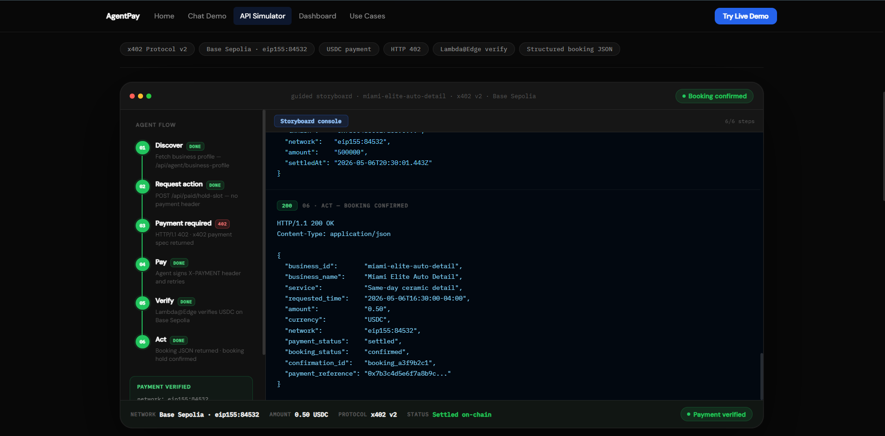
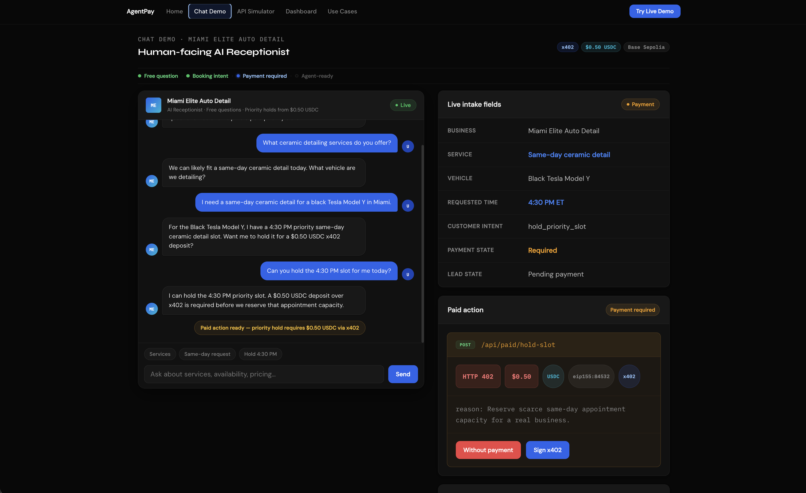
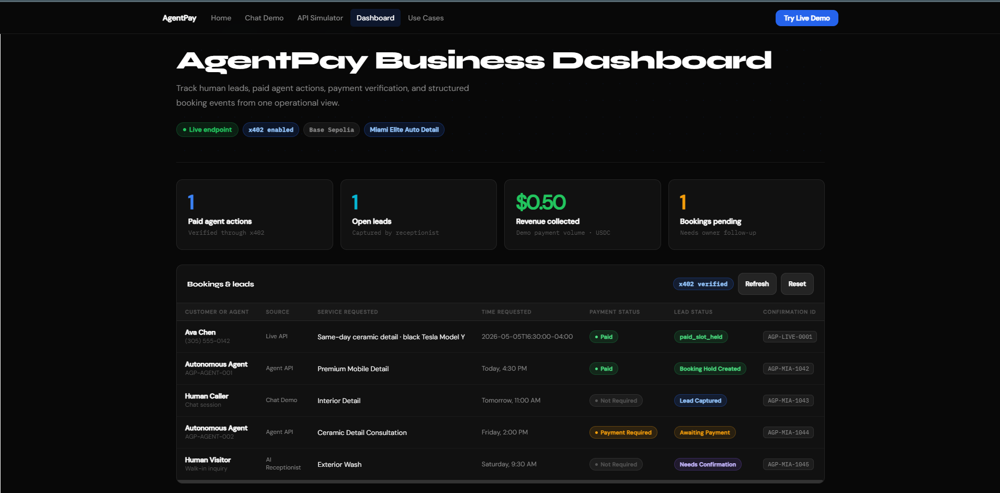
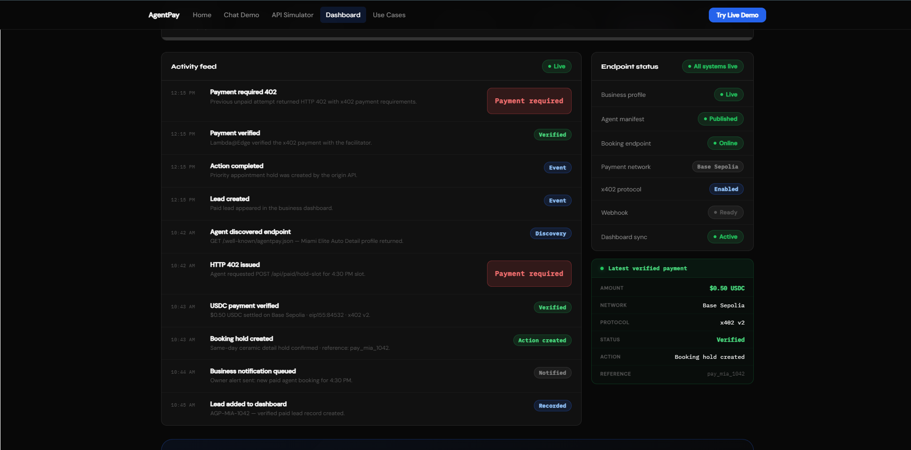

# AgentPay Receptionist

AI receptionist that turns a local service business into a payable HTTP endpoint — discoverable by humans and callable by autonomous AI agents, paid in USDC via Coinbase's x402 protocol. **🏆 2nd place, ~100 teams — EasyA x Consensus Miami Hackathon (May 2026).**

## Why I built it

AI agents can already search, reason, and plan — but they can't transact with real-world local businesses. A business has a website and a phone number, not a machine-readable capability catalog an agent can call, or a standard way to pay for scarce actions like holding an appointment slot. AgentPay closes that gap: `GET /api/agent/business-profile` gives an agent everything it needs to discover what a business offers and pay for it, with zero custom integration.

## Tech Stack

AWS (CloudFront, Lambda@Edge, API Gateway, DynamoDB, WAF Bot Control, SSM, Secrets Manager) · TypeScript · Coinbase x402 SDK (`@x402/core`, `@x402/evm`, `@x402/fetch`) · viem · USDC on Base Sepolia

## Key technical decisions

- **Payment enforcement lives at the edge, not the application.** The x402 verify/settle logic runs in Lambda@Edge in front of CloudFront — an unpaid request never reaches the origin API at all. The business logic never has to think about payment state.
- **Verify-then-settle is split across two Lambda@Edge functions**, and settlement only fires after the origin API returns a successful `200`. Payment without delivery, and delivery without payment, are both impossible by construction — not by convention.
- **Pricing is runtime config, not a deploy.** Route prices live in SSM Parameter Store and sync into a WAF rule group every 5 minutes; changing a price is two AWS CLI calls, no redeploy.

## Results

2nd place out of ~100 teams at the EasyA x Consensus Miami hackathon. Full working payment loop: HTTP 402 → x402 signature → Lambda@Edge verification → real USDC settlement on Base Sepolia → booking confirmation, demoed live to judges.

## Demo

- Live demo: https://d2pc20oig2383p.cloudfront.net/#/
- Demo video: https://screenapp.io/app/v/GjHYXQEYcm
- Full technical write-up (architecture, payment flow, API routes, deploy instructions): [TECHNICAL_WRITEUP.md](TECHNICAL_WRITEUP.md)

## Screenshots

 

---

Built by [Nate](https://github.com/natepaulo43-oss) and [Laird Miller](https://github.com/lmandlmrentai) for the EasyA x Consensus Miami hackathon.
